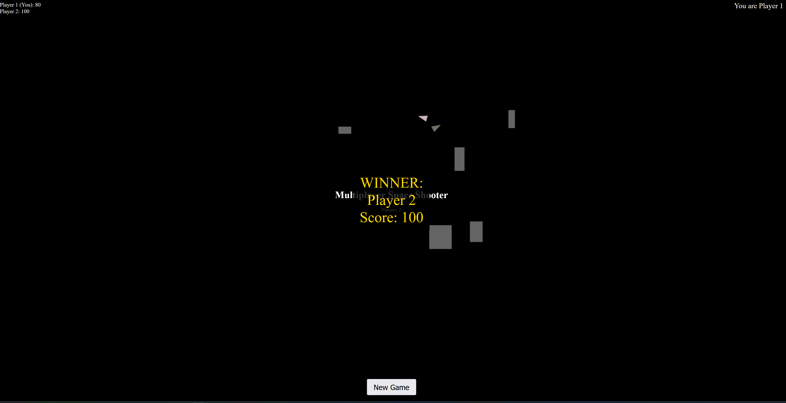

# 🚀 Multiplayer Space Shooter

An exhilarating real-time multiplayer space shooter game built with HTML5 Canvas and WebSockets!



## 🌟 Features

- Real-time multiplayer action
- Colorful, fast-paced gameplay
- Destructible obstacles
- Dynamic scoreboard
- Host-based game control

## 🛠️ Installation

1. Clone the repository:
   ```
   git clone https://github.com/yourusername/multiplayer-space-shooter.git
   cd multiplayer-space-shooter
   ```

2. Install dependencies:
   ```
   npm install
   ```

## 🚀 Running the Game

### Development Mode

To run the server with hot reloading:

```
npm run dev
```